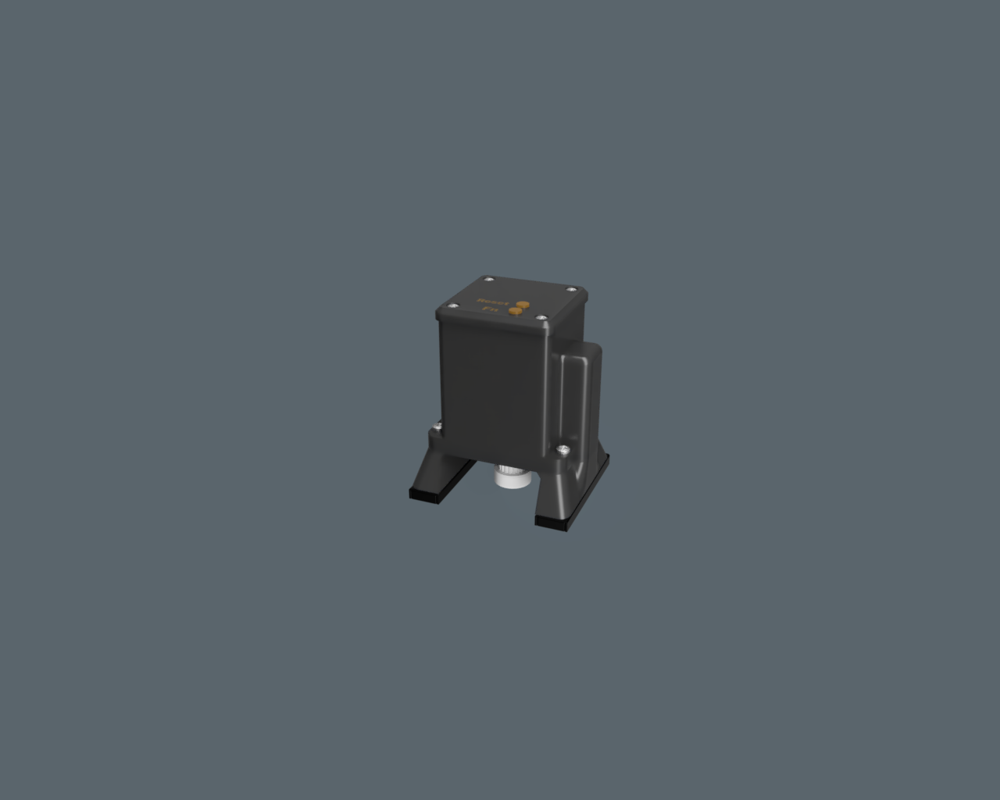

# Project Name

Brief project description and purpose.

## Table of Contents
- [Project Name](#project-name)
  - [Introduction](#introduction)
  - [Usage](#usage)
  - [License](#license)

## Introduction

Explain what your project does, its goals, and why it exists. Provide some context for why someone might want to use it.

## Usage

Show examples and explain how to use your project. Use code samples and screenshots if necessary.

## License

State the license under which your project is released. This helps users understand what they can and cannot do with your project.

