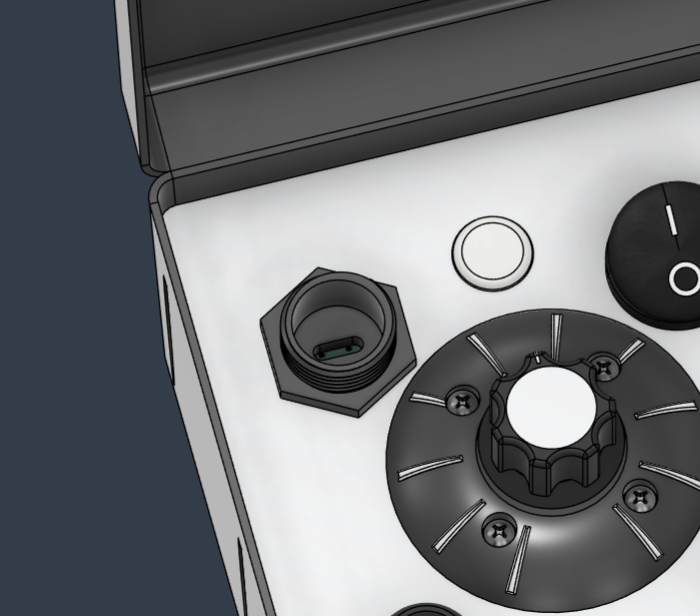

# RemoteWelderController #

A pair of devices meant to retrofit older welders with wireless connectivity. This document covers the usage and mechanical makeup, the cost overview can be found [here](https://github.com/andrew153d/RemoteWelderController/tree/main/hardware).

--- 

        

## Usage

There are three main modes of operation: Standard, Web Control, and Extended Web Control

### Standard Control

To enter standard control mode, toggle the Transmitter power switch to the 'ON' position and press the Power button on the Receiver. While the devices are searching for each other, their status LEDs will flash blue and will transition to solid green when connected. Rotation input on the control knob will result in proportional motion on the output shaft of the receiver. 

### Web Control

Web Control Mode will allow the user to make use of the web interface to control the output of the receiver. Press the power button on the receiver to turn the device on. After the status LED flashes blue, hold the power button for 3 seconds or until the LED turns to solid green. Connect your phone to the wifi network named Weld_xxx, open a browser and go to 'Weld.local'.

### Extended Web Control

Extended Web Control uses the Transmitter to host the webpage and repeats control to the receiver. After turning on both devices, hold both the up and down buttons for 3 seconds until the status LED turns green. Connect your phone to the Wifi network named Weld_xxx and open the site 'Weld.Local'. In order to increase the distance, place the transmitter between the user and the receiver.

## Mechanical Details

### Web Interface 

The webpage for control and configuration. Of course you can stay loyal to your brand while still bringing your welder into the modern world. The dial can be dragged to rotate, or the user can swipe the arrows at the bottom to rotate the knob. The lock button will match rotation on the output to the knob on the webpage. The align button will automatically measure the range of the output and scale the input accordingly. Settings and more configuration options can be accessed via the menu on the top left. 

### Transmitter

Top view of the pelican case with reciever stowed on the right side.

The charge port cap can be removed to expose the USBC port and charge the device.

The circuit board and battery pack get mounted under the faceplate. Not shown is a cover to shield the electronics from debris under the faceplate.

### Receiver

    

        Receiver is shown without belt mechanism. The hatch is biased closed by a torsion spring and sealed against the surface with a O-ring.
    

    
    

    

    Shown below is the hatch on the receiver that exposes the charging port, status led, and power button. The power button serves multiple alternative functions described in the usage section.
    

    

    

    There are several seals on the receiver that maintian water resistance. The upper seal gets compressed between the upper cover and the case. There is also a seal on the access hatch as well as around the motor shaft.
    

    
    

